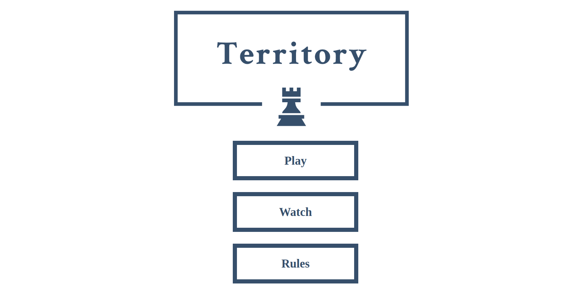
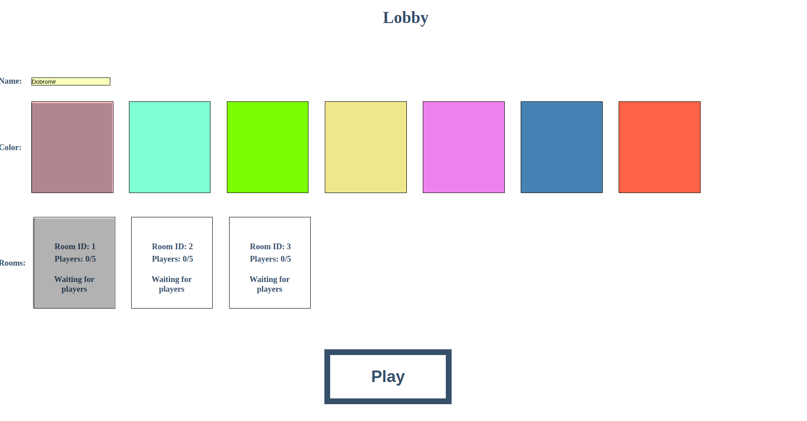
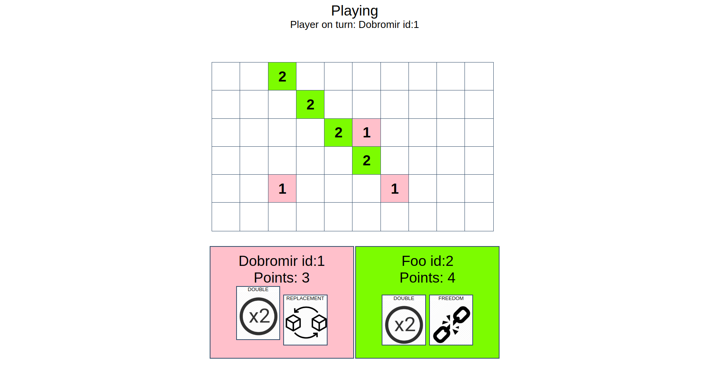

# Territory
Multiplayer turn based board game built using Java and React.

# 1. Game

The game is played by two to five players. Each player has to choose a name and a colour. Players take turns placing tiles on the board, the first player to start is the first player that connects to the specific room. Tiles can be placed only on empty cells and only on cells adjacent to one of the other tiles of the player.

Each player is given three influence cards at the beginning of the game. A player can use any of their influence cards when making a move. Once a card is used, it is discarded (i.e. each influence card can be used at most once by each player). An influence card makes an exception from the previous rule.

Double-move card: allows the player to place two stones in one move. (In terms of the adjacency rule, this move is interpreted as two consecutive moves.) 

Replacement card: allows the player to place a stone even if the cell is not empty. The adjacency rule still applies. 

Freedom card: allows the player to place a stone on any empty cell, even if it is not adjacent to their existing stones.

A player is called 'blocked' if they cannot make a move, even if using one of the influence cards available to them. If a player is blocked, they skip their turn. The game ends when all the players are blocked. The winner of the game is the player with the highest number of stones on the board. If there are several such players, the one of them who joined the game last, wins.

# 2. Architecture

The project is split into front-end and back-end. The back-end is built in Java using an
embedded tomcat server. It contains three modules, one for the game logic, one for the
endpoints and one for the bot. The front-end is built using React.

# 3. Interface
The user interface is built similarly to a typical game. The main page is the main menu
which contains link to all the different pages of the game. It has two separate modes, Play
and Watch. When one of the two modes is selected, the player is sent to a lobby in which he
can choose either his player name, color and room, or only the room he wants to spectate.
The rooms in the play lobby are filtered so that only the rooms which the player can join are
shown. In the watch lobby, all previously finished games and all currently running games are
available to see. All of the html forms have validation which displays appropriate messages
if you have missed to fill the specific field. A page outlining the game rules have been added
on the main menu. A custom error screen is shown if the user tries to connect to a game
which is already in progress or if an error occurs while the player is trying to join a specific
game room. When the player joins a room, there is a system in place for starting the game
which waits for all players in the room to set their status to ready before starting the game. If
a player disconnects from a running game all of his tiles become grey and he is removed
from the room. The players turn order continues as normal by skipping over the
disconnected player. Another additional feature is that if only one player is not blocked, the
board is automatically filled with tiles for that player so that he won’t have to select each tile
individually.

# 4. Bot
The bot player can be started by specifying custom name, color and the room you wish him
to join. After joining it waits for 30 seconds before setting its status to ready. The bot waits
for 1 second before sending his move. The logic is split into three phases:

Reach Phase – This is the initial phase in which the bot tries to take the tiles which give him
the most reach. He prioritises tiles that give him access to previously unreachable tiles and
select the ones which give him the maximum number of newly reachable tiles. In case of
two tiles being the same in regards to reach increase, he chooses one of them at random. The
bot looks not only at empty tiles but also at tiles which are already occupied. If an occupied
tile gives him the most reach he will use replacement card in order to take it.

Guard Phase – This is the second phase which starts after the bot can no longer expand his
reach. In this phase the bot will look for empty tiles which are surrounded only by his own
tiles or empty tiles. He will then try to fill the empty tiles with its own in order to guard
them from the reach of other players. He will start by picking the tile which has the
minimum empty tiles around it to guard first. Again, in case of tiles having the same amount
of empty tiles around them, he will pick one of them at random. The bot will also use the
double card on its first move of the phase in order to guard the tiles faster.

Endgame Phase – This is the final phase which starts after there are no more tiles that can be
guarded on the board. The bot creates a list of all the tiles that only he has access to and
leaves them for last, it instead selects at random from all the other tiles until all of them are
taken. It then populates the guarded tiles and as a last resort it uses any freedom or
replacement cards that he might have left in his hand.

After the game has finished the bot waits for a minute before disconnecting.

# 5. Screenshots

